# Advanced Computer Hardware Design - Lab 2

# Superscalar Out of Order RISC-V Execution

## Paul-John Clet

## March 2024


## Contents

- 1 Introduction
- 2 High-Level System Design
- 3 SystemVerilog Modules
   - 3.1 Instruction Queue
   - 3.2 Dispatch Units
      - 3.2.1 Stage 1: Decode
      - 3.2.2 Stage 2: Structural Hazard Detection
      - 3.2.3 Step 3: RAW Hazard & Instruction Dispatch
   - 3.3 Register Alias Table
   - 3.4 Reservation Stations
   - 3.5 Functional Units
- 4 Test Cases and Simulation Results
   - 4.1 Instructions to Test
      - 4.1.1 Expected Results
   - 4.2 Simulation Results
   - 4.3 Known Bugs
   - 4.4 Achieved Project Goals
- 5 Code
- 6 Conclusion and Summary
- 7 References


## 1 Introduction

To increase the instructions per cycle (IPC) of a processor, the superscalar system was designed. Su-
perscalar systems implement a level of parallelism on a processor. Combining this with out-of-order
execution results in a robust system that has the potential to execute instructions at a much faster speed.

For this project, the goal is to implement the superscalar out-of-order RISC-V processor. The pro-
cessor should be able to execute 2 types of instructions, support two functional units, and follow the
RISC-V ISA. It should also stall and end the execution depending on data hazards and instruction
completion respectively. Lastly, it should be designed in a way that efficiently implements Tomasulo’s
algorithm.

## 2 High-Level System Design

To achieve these goals, five distinct modules have been designed and can be defined as follows.

```
Module Name Abbreviation Description
Instruction Queue IQ Provide instructions to DUs
Dispatch Unit DU Decode instructions, check for hazards, send data to RAT
Register Alias Table RAT Hold data & tags, send data to each RS
Reservation Station RS Solve data hazards, hold instructions for ADDER/MUL
Functional Unit ADDER/MUL Execute instruction
```
These five components combine to create the superscalar out-of-order RISC-V processor design. This
project has been simplified to only handle ADD/MUL instructions, however, this project could be
expanded to address each type of instruction. The image below shows the basic high-level design and
how the data should flow.

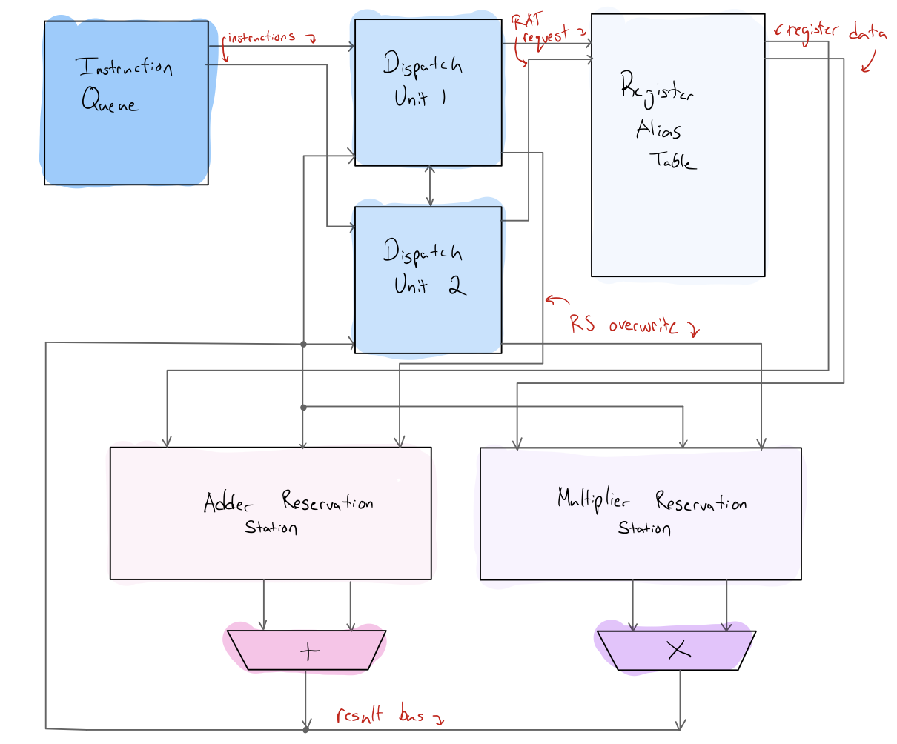
```
Figure 1: High-level component design
```
Starting at the instruction queue, two instructions will be sent at a time to each dispatch unit. This
allows for a 2-way superscalar processor. After processing and checking for any structural or data
hazards, a register alias table request will be made. This request tells the RAT to send data to the
respective reservation station. The reservation station handles most of the data hazards and allows for
out-of-order execution.

Once there are valid instructions, the reservation stations will send instructions to the adder and
multiplier functional units. After a certain number of cycles, each functional unit will output the data


on the result bus. This will be heard by the reservation stations and the register alias table, allowing
for each module to update its contents respectively. The bus update completes the full execution of 1
instruction. This cycle continues until all instructions have been completed.

## 3 SystemVerilog Modules

The modular structure and design choices will be broken down in this section. Each module runs both
synchronously and asynchronously to enable the sub-clock cycle speeds that superscalar architecture
can achieve. This results in each module having the clock signal as an input.

### 3.1 Instruction Queue

The instruction queue is a single module that provides instructions to 2 separate dispatch units. This
is the start of the pipeline and handles the instruction fetch (IF) stage of the RISC-V pipelined CPU.

The two inputs to this module are the ready signals from each dispatch unit. Once both dispatch
units have processed and sent out their signals, they will turn on their ready flags and request another
instruction from the instruction queue (IQ).

The only outputs of this module are the instructions themselves and a flag that turns on when the
instruction queue is empty. This helps achieve one of the project goals, which is to turn off the simula-
tion once all instructions have been completed. This goal is completed in the dispatch unit.

Lastly, each instruction is fetched in order. This means that each respective dispatch unit will re-
ceive their own instruction from the program order. If there are instructions left in the queue, the
module will output the first instruction, increment the counter, and then output the next instruction.

### 3.2 Dispatch Units

The dispatch unit is one of the more complex modules because of all the checks it performs before
allowing instructions to pass. It has been designed in this project to perform a 3-stage checking process.
There are 2 dispatch units used, which will be referred to as DU1 and DU2. It can be assumed that DU
has priority, meaning its instructions will be processed right before DU2’s instructions are processed by
the register alias table (RAT). This helps fulfill the superscalar aspect of the project goals, allowing for
two instructions to be decoded at one time.

#### 3.2.1 Stage 1: Decode

To simplify the modules, the decode stage (ID) of the RISC-V pipelined CPU is performed in this
dispatch module. Essentially this checks what type of instruction it is by using the RISC-V instruction
breakdown. The figure below is from the RISC-V green card [1].

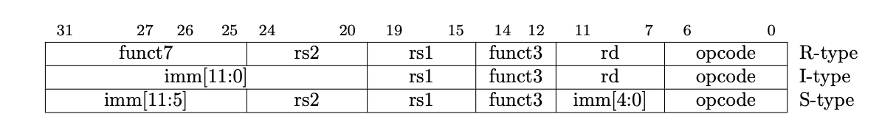
```
Figure 2: RISC-V bit breakdown for each type of instruction
```
Since only R-type instructions are being performed in this project, the only relevant row is the first in
the above figure. The below images show the add and mul instructions from the same source.
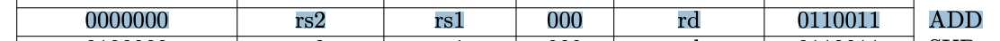
```
Figure 3: ADD instruction breakdown
```
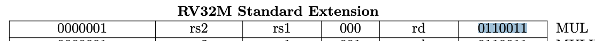
```
Figure 4: MUL instruction breakdown
```
The two instructions have the same funct3 and the same opcode. Where they differ is the funct7, where
MUL is 1 instead of 0. To implement a no operation (nop), any code that does not follow either of
these two instructions is processed as a nop.

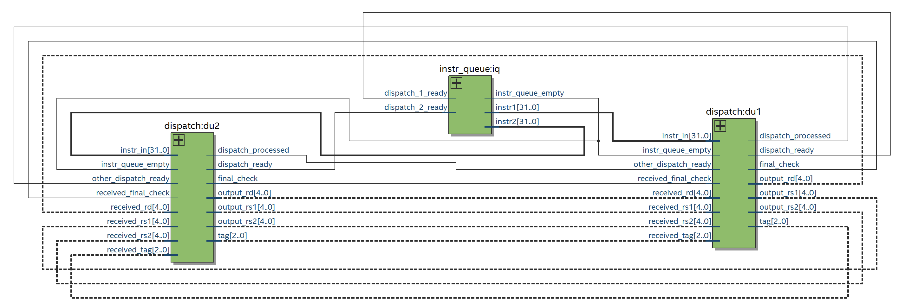
```
Figure 5: Connections between IQ and DUs
```
Once the instruction is decoded, each DU has determined what their registers (rs1, rs2, and rd) for the
instruction are. Each DU has also determined the type of instruction. The DUs then communicate this
data with each other and move on to stage 2. The figure above shows the signals that are communicated
between each dispatch unit.

#### 3.2.2 Stage 2: Structural Hazard Detection

Another goal of this project is for both dispatch units to stall if there is a structural hazard. This
essentially means that each dispatch unit should know if there is enough room in the reservation station
for each instruction.

To solve this problem, two signals are coming from each reservation station to both DUs. The first signal
is a 2-bit count on the number of remaining spots. Since both DUs know what type of instructions are
being sent, they can use the number of remaining spots to check if there is space for both instructions.
The 4 cases are checked as shown in the below code snippet.

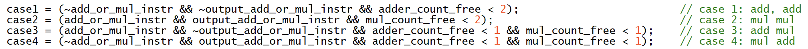
```
Figure 6: Code snippet showing the 4 cases that are checked
```
The other signal is a 4-bit encoded signal that tells the DU which slots are open. For instance, the
signal will be ”0000” when all slots are open, ”1110” when the first slot is open, and ”0010” when only
the second slot is occupied.

With this data, the module can determine which slot to send the instruction to in the reservation
station based on its priority. The DU with higher priority will get the first slot. This matters in this
example corner case: ”0011” from the adder reservation station. With slots 1 and 2 taken, the correct
response should be: DU1 gets slot 3 and DU2 gets slot 4.

#### 3.2.3 Step 3: RAW Hazard & Instruction Dispatch

During this stage, DU2 checks for a RAW hazard. A RAW hazard is checked by seeing if the rd from
DU1 is equal to either the rs1 or rs2 of RU2. DU2 must check for this because it does not have priority,
so it must update the respective RS with the tag if it does exist. This is accomplished through an
override signal sent directly to the correct RS.

After this occurs, then the instruction can finally be sent to the RAT. The encoded instruction contains
the registers used by the instruction and the intended destination in the form of a tag.

### 3.3 Register Alias Table

The RAT stores the register data in the form in the table below. There are 32 entries, each comprised
of 36 bits, representing each of the 32 registers in the RISC-V architecture.

```
Valid Tag Value
Bits 35 34:32 31:
```
The initialization of this module will set each register value to its respective register number. This
saves time and reduces the project scope so I-type instructions are not implemented. A part of the
initialization step can be seen in the below figure.

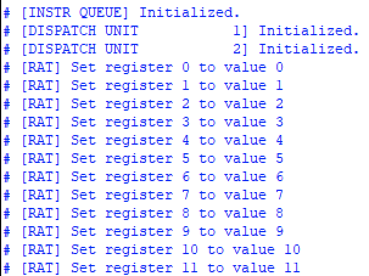
```
Figure 7: Snippet of the IQ, DU1, DU2, and RAT initialization
```
After initialization, the RAT will listen for two types of flags. The first flag comes from instructions
and the second comes from updates from the functional units. When an instruction is received from the
DUs, the RAT will first update the RD with the tag. Next, the RAT will send the data to the correct
reservation station to be executed.

When there is a value update from a functional unit, the value will be updated in the respective
entry by matching the tag. Additionally, the RAT will display any updates in the simulation console.

### 3.4 Reservation Stations

In this project, there is a reservation station for each of the two functional units. The reservation station
solves the data hazards that were not previously covered, including WAW, RAR, and another case of
RAW. The breakdown of each entry in the RS can be seen below.

```
rs1 Valid rs1 Tag rs1 Value rs2 Valid rs2 Tag rs2 Value
Bits 71 70:68 67:36 35 34:32 31:
```
The full reservation station contains four entries which can be seen in the following table. All values
can be assumed as binary except for the two decimal value fields.

```
ID rs1 Valid rs1 Tag rs1 Value (decimal) rs2 Valid rs2 Tag rs2 Value (decimal)
000 0 111 0 0 111 0
001 0 111 0 0 111 0
010 0 111 0 0 111 0
011 0 111 0 0 111 0
```
Looking at the ID, there is an unused bit which is the most significant bit (MSB). This bit is used to
specify whether the reservation station is for the adder or the multiplier functional unit. In this project,
the MSB being ”0” represents the adder unit, and ”1” represents the multiplier unit.

In the initialization step of the RS, the adder reservation station, or RSADD, will look like the table
above. Both the valid bits and the values are set to 0. The tag bits are set to ”111”, which is known
as the ”no tag code”. This is used to be able to tell if the tag has been modified by the dispatch unit.

The reservation station has four main functions. The first is to issue an instruction whenever there
are two valid operands in the table. The second is to check for any bus interactions and update corre-
sponding values. This is accomplished in the same way that the RAT does. The third is to check for
updates from the RAT. This occurs after dispatch has sent an instruction to the RAT. The RAT will
correspondingly send these values to the RS to be loaded. The last function is to listen for overwrites
from the dispatch unit. These overwrites, as previously mentioned, will solve the RAW issues in the
superscalar dispatch module.

### 3.5 Functional Units

The last module is the functional unit, which uses a parameter to specify whether it will perform addi-
tion or multiplication. Once it receives a valid instruction from its corresponding reservation station, it
will start executing the instruction. In this project, an add instruction will be completed after 4 clock
cycles, and a multiplication will be completed after 6 cycles.

Once the execution is completed, it will broadcast the value on the respective bus.


## 4 Test Cases and Simulation Results

### 4.1 Instructions to Test
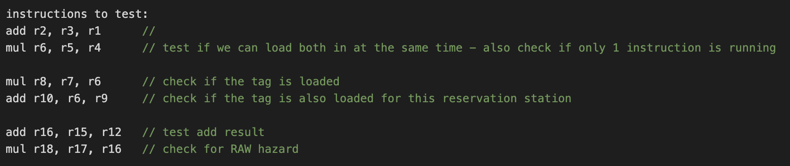
```
Figure 8: Screenshot of the test instructions
```
In the above set of 6 test instructions, several aspects of the machine will be tested. The first two
instructions will ensure that the superscalar dispatch modules work. Next, instructions 3 and 4 will
check for the tag to be loaded from the RAT properly. These two instructions should not execute until
the register R6 is resolved by the multiplier. The last two instructions will test for the RAW hazard
that should be detected by the dispatch unit.

To allow for these to be read properly, they must be converted into either binary or hex and stored
in the instruction queue. Following the RISC-V instruction format, the image below shows how the
instructions were created.
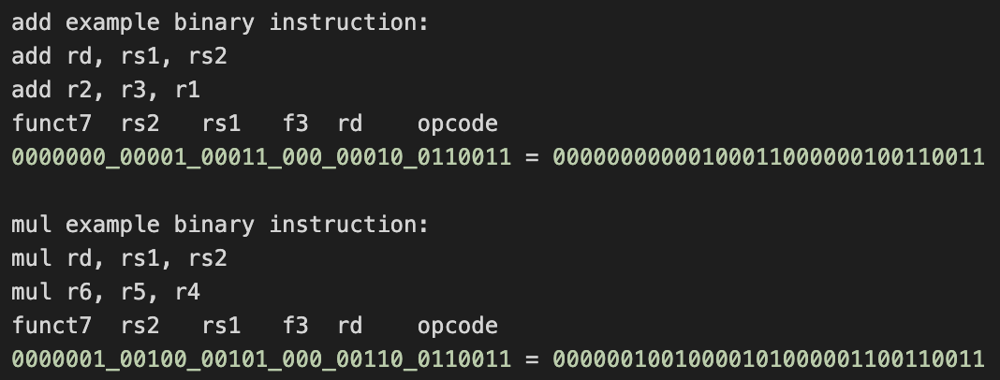
```
Figure 9: Conversion of RISC-V MIPS instruction to binary
```
Each component of the R-type instruction is split by the bits so it is easier to visualize. This format
can be followed for each instruction as seen in the following image.
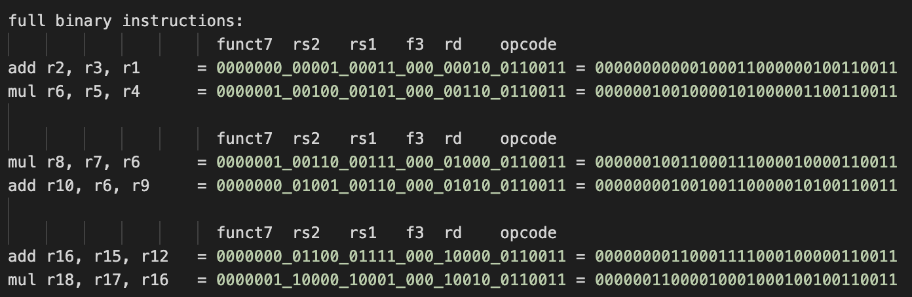
```
Figure 10: All instructions converted to binary
```
This results in the following set of final instructions that are directly read into the instruction queue
using the ”$readmemb” function.

```
Final Instructions
00000000000100011000000100110011
00000010010000101000001100110011
00000010011000111000010000110011
00000000100100110000010100110011
00000000110001111000100000110011
00000011000010001000100100110011
```

#### 4.1.1 Expected Results
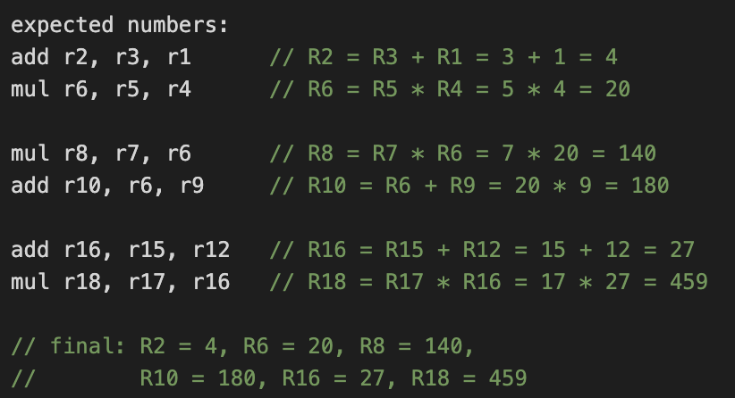
```
Figure 11: Expected values for each instruction
```
The above figure shows the expected output for each of the registers. During simulation, the expected
output above should be printed out to the console and shown in the waveforms. These will be used
during the verification process.

### 4.2 Simulation Results

To verify the implementation, the strategy was to print the relevant outputs each clock cycle and see
if they are as expected. This was aided by analyzing waveforms to determine if signals were initialized
correctly. This strategy ultimately saved time during the debugging process.

Screenshots of the simulation results can be found in the ”images/” folder in the Github repository
linked in section 5 below. The figures below show the full functionality of instructions 1, 2, and 5. The
first instruction is an add instruction and the second is the multiply instruction. From the screenshot
below, it is clear that the signals themselves verify the outputs of instructions 1 and 5.
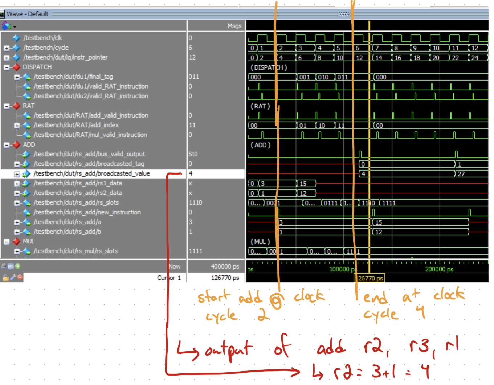
```
Figure 12: Results image 1
```
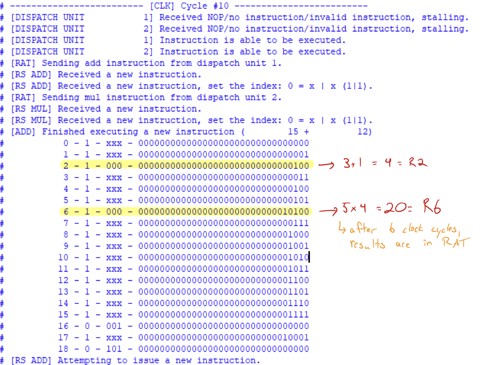
```
Figure 13: Instruction 2 output broadcast to the bus
```
There are several key points to the output above. Firstly, it shows that both the add and multiply
instructions are executed at the same time. This proves the superscalar nature of the design. It also
shows the difference in clock cycles, with the add completing after 4 cycles (starts in cycle 2, completes
in cycle 6) and the multiplication completing in 6 cycles (starts in cycle 2, completes in cycle 8).

The figure also shows the output of instruction 2. Instruction 2 is the multiply instruction mul r6,
r5, r4. Since the values are initialized to their register number, the expected value for r6 in this case is
20, which is broadcast on the bus once the instruction has been executed. Another important aspect
that is shown in the figure is how everything is performed in the correct clock cycle. After the instruction
is decoded and dispatched in the same cycle, it will begin execution in the next if it has the available
resources. This is evident in clock cycles 1 and 2 where validRATinstruction happens 1 cycle before
the functional unit receives a new instruction. This means that the data travels from the dispatch unit
to the RAT, to the reservation station all in the same cycle. This is the desired performance of the
superscalar processor.

```
Figure 14: Simulation output
```
The above screenshot shows a snippet of the simulation output where registers 2 and 6 have the cor-
rect values. Register 2 should have the value of 3+1 = 4 and register 6 should have the value of 5∗4 = 20.

Every time a value is broadcast on the bus, it will be heard by the RAT. The RAT will output this table


and update the corresponding tag after if it is valid. This specific screenshot was taken after instruction
4 was completed.

### 4.3 Known Bugs

While all of the logic for this project and the project goals have been implemented, there are a few
known bugs that have hindered a perfect simulation. The first is that the reservation station fails to
delete instructions, which causes issues further down the line. This will keep the processor in an infinite
loop since the number of instructions left does not decrease. This happens even though the logic to
stop the program execution after the instructions complete has been synthesized.

Another interesting bug is the skipping of instructions. Oddly, the system found a structural error
while trying to execute the third and fourth instructions. This caused it to stall and even skip the
instruction. All of these errors can be fixed with a few more hours of debugging, however, were not be
due to time constraints.

### 4.4 Achieved Project Goals

All of the baseline project goals have been implemented and achieved with the exception of the execution
stopping due to the aforementioned errors. The target goals have also been implemented, however, not
all were able to be tested due to the same errors.

## 5 Code

The code can be found at the following Github link. It includes images of the output, as well as any
files that were relevant to the completion of this project. The project was completed in SystemVerilog
using Intel Quartus Prime for synthesis and ModelSim 2020.1 for simulation and verification.

```
https://github.com/pjclet/Superscalar-Out-of-Order-RISC-V-Execution/tree/main
```
## 6 Conclusion and Summary

Through designing a superscalar out-of-order execution RISC-V processor, many challenges have been
overcome. The greatest challenge for this project was understanding how the dispatch unit fit into everything.
It was very arbitrary at first, however, through different resources, it became much more clear. Trying
to implement it on a modular level was also difficult, and a whole three-step algorithm was ultimately
designed. Overall, nearly all the project goals were achieved. Each module was designed, synthe-
sized, and tested. Through this project, I have a clearer understanding of how both superscalar and
out-of-order execution machines function.


## 7 References

[1] A. Waterman and K. Asanovi ́c, \The RISC-V Instruction Set Manual Volume I:
User-Level ISA Document Version 2.2," 2017. Available: https://riscv.org/wp-content/uploads/2017/05/riscv-spec-v2.2.pdf
‌


